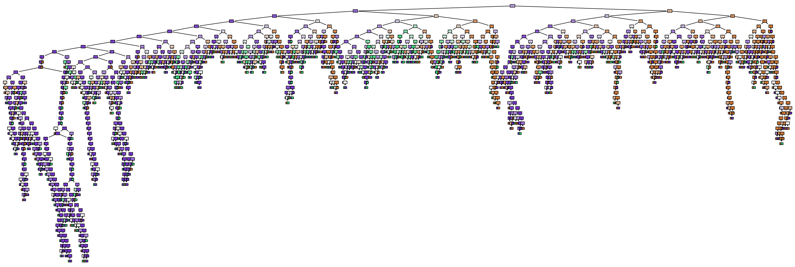

# PW09
Team : Magali Egger, Maxim Golay, Pascal Perrenoud

# Part 1
## Q1.1
## Q1.2
## Q1.3
## Q1.4
On peut voir que le modèle obtient un F1-score de 100% sur le training set mais qu'il n'est pas bon sur le test set. C'est un cas évident d'overfitting.
L'overfitting peut être résolu en balançant les classes ou en utilisant la technique de cross-validation sur plusieurs splits.

## Q1.5

Une "node" est un "test" sur une observation qui guide, selon les valeurs, vers une prochaine node ou une "leaf".

Un "edge" est le segment qui relie deux nodes, ou une node et une leaf. La condition testée dans une node étant booléenne, il y a 2 "edge" par node, le "oui" et le "non".

Une "leaf" est une "décision" ou un label sélectionné. C'est la fin d'un chemin et la "sortie" d'un decision tree.

## Q1.6

La node tout à gauche, à l'avant-dernier étage, donne les informations suivantes :
- La première ligne représente le test : est-ce que x[6] est plus petit ou égal à 0.17 ?
- La seconde réprenste le gini des valeurs encore disponibles à cette étape
- La troisième est le nombre de samples qui arrivent jusqu'à cette node, celles qui n'ont pas pris d'autres chemins
- La dernière ligne représente la classe actuellement supposée à cet endoit de l'arbre

## Q1.7
Ce modèle ne fait plus d'overfitting, les résultats du training étant bien plus balancés.

## Q1.8
La classe R ou "REM sleep" est difficile à différencier de la classe W ou "awake". Ceci a une explication biologique : la phase de REM ou "rapid eye movement" est une phase du sommeil où le cerveau présente une activité quasi équivalente à celle de l'état d'éveil. Il est donc difficile de différencier ces deux classes.

## Q1.9
Dans le cas d'un dataset "unbalanced", cet hyperparamètres va balancer les différentes classes afin de réduire l'effet de la sur-représentation d'une classe par rapport au une/aux autre.s.

## Q1.10
Le modèle 2 est plus précis sur les classes les plus représentées, les classes N et W, là où le modèle accorde plus d'importance à la classe sous-représentée, W.
Le modèle 2 aura l'avantage d'être plus précis, à condition d'avoir un dataset "balancé", ce qui n'est pas notre cas. Au contraire, le modèle 3 sera plus "équitable" avec toutes les classes mais aura un résultat final moins bon.

# Part 2
## Q2.1

Les tests montrent qu'il est bien de limiter la profondeur de l'arbre, que le nombre d'estimateurs a un minimum mais peu d'influence autrement, que le nombre de features max importe peu et qu'augmenter le nombre de sample améliore le score, ce qui paraît logique.

## Q2.2
Ces graphes ne teste que le paramètres seuls, mais ne compare pas les hyper-paramètres entre eux. Il n'est donc pas possible de voir si deux hyperparamètres ont un "sweet-spot" ensemble.

## Q2.3
Ces plots montrent justement les "performances" des hyperparamètres, couplés 2 par 2.

## Q2.4
Certains paramètres sont tirés "au hasard" et n'ont donc sûrement pas été couvert. Ces points sont donc remplacés par des points blancs.

## Q2.5
Ces plots permettent de voir les relations entre deux hyperparamètres.

## Q2.6
La "grid-search" est une manière de chercher les meilleurs hyper-paramètres de manière exhaustive, en couvrant comme ici toutes les valeurs.

## Q2.7
Voici la recherche que je ferais :
- max_depth : 3-8

## Q2.8
## Q2.9
## Q2.10
## Q2.11
## Q2.12

# Part 3