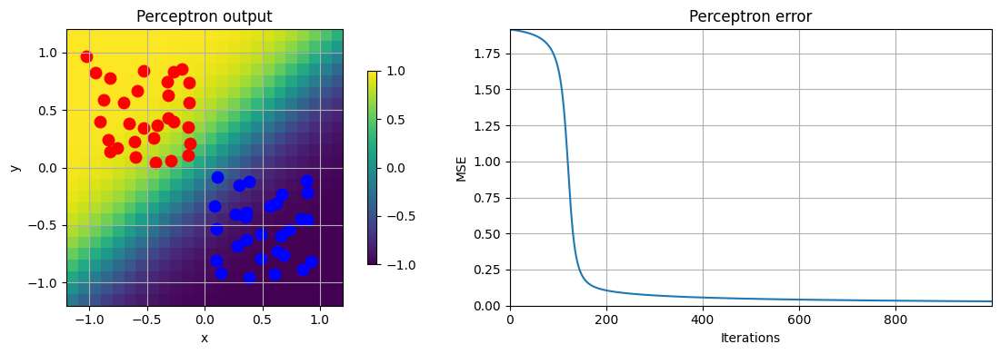
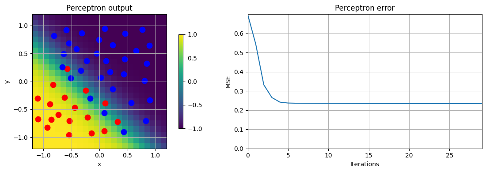
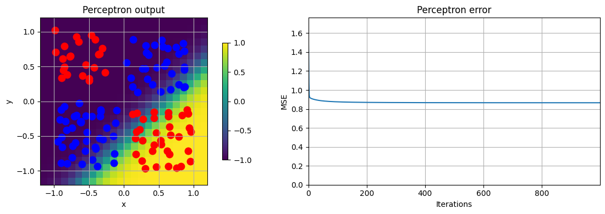
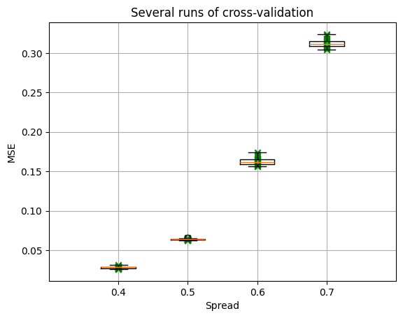
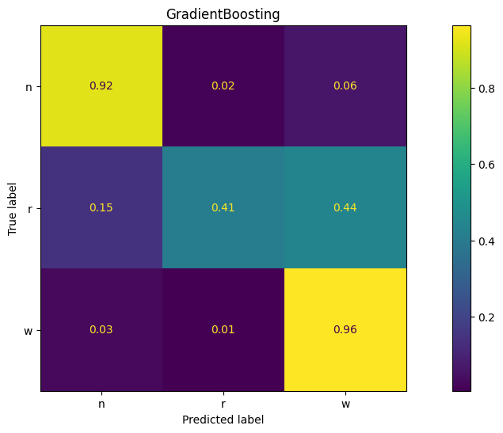

# MachLe - PW10
Team : Magali Egger, Maxim Golay, Pascal Perrenoud

## Notebook 4 : Q1-3
### Q1

When learning a well separated dataset, a MLP model will converge quickly, without too much oscillation (unless you use a rate of 10 of course...). A "big" learning rate works as well as smaller ones. A learning rate of 0.01 works well. We might find local minimas, as any line splitting the two classes works.

### Q2

When the classes slighty overlap, the model will oscillate a little before finding a good separation. A learning rate of 0.01 gives a good result without too much oscillation. There is less local minimas where the model can be stuck, then line will always be where the classes are mixed.

### Q3

With a single line, the model will oscillate a lot. Almost every training will give another result, as the model will be stuck in a local minima every time. A big learning rate makes the model oscillate even more.

## Notebook 8 : MSE vs spread

We see in this plot how the MSE score is exponential and how the spread of the distribution of a class will affect this score.
We can suppose that a model training on data with a big spread will therefore have a higher MSE score as the difference are more severely "punished" by the exponentiation in the MSE.

## Notebook 9 : Comparison with last week
