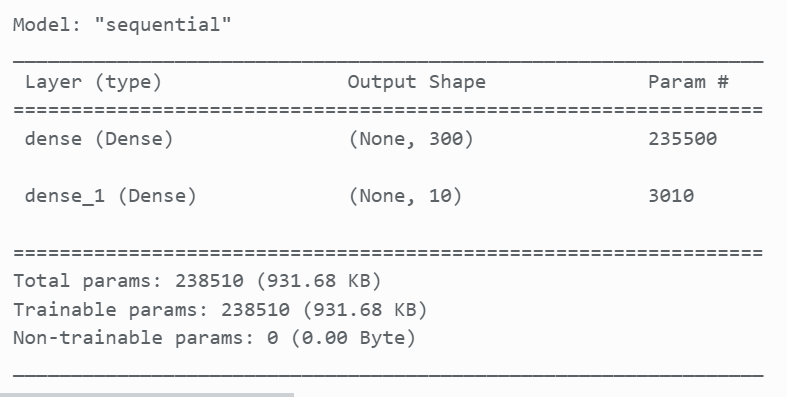

# MachLe - PW11
Team : Magali Egger, Maxim Golay, Pascal Perrenoud

## Part 1
### What is the learning algorithm being used to train the neural networks? 
The algorithm used is a shallow neural network with the following architecture:

### What are the parameters (arguments) being used by that algorithm?
The parameters are the following:
- batch_size: 128
- epochs: 15
- optimizer: RMSprop
- loss: categorical_crossentropy
- metrics: accuracy

### What cost function is being used? please, give the equation(s) and describe (e.g., please include your code for this part) 
The cost function is the categorical_crossentropy. This function is used to calculate the loss between the predicted and the actual value. The categorical_crossentropy is the negative log-likelihood of the true class. It is defined as follows: $ Loss = - \sum_{c=1}^{M} y_{o,c} \log(p_{o,c}) $ where $M$ is the number of classes, $y_{o,c}$ is a binary indicator of whether or not class $c$ is the correct classification for observation $o$, and $p_{o,c}$ is the predicted probability observation $o$ is of class $c$.

### how did you create the training, validation and test datasets.
The training and test set are collected directly by importing the data from the datasets. The validation set is created by splitting the training set into a training and validation set. The validation set is the first 10000 images of the training set. The training set is the remaining images of the training set.