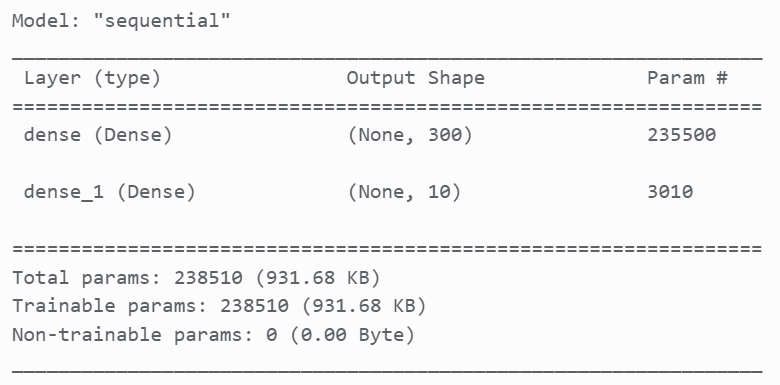
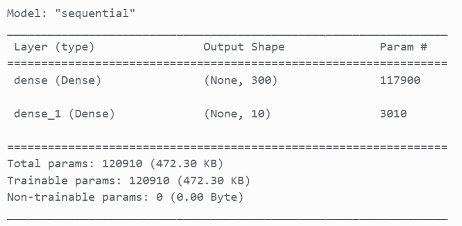
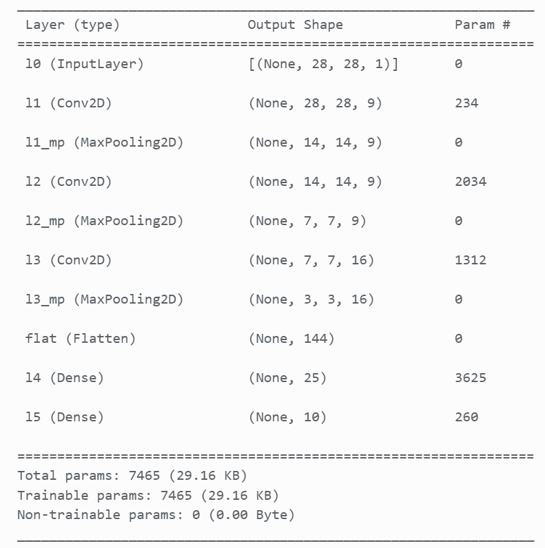

# MachLe - PW11
Team : Magali Egger, Maxim Golay, Pascal Perrenoud

## Part 1
### What is the learning algorithm being used to train the neural networks? 
The learning algorithm is composed of a categorical_crossentropy loss function (decribed below) and a RMSprop optimizer. The RMSprop optimizer is an adaptive learning rate method. Its key features is to maintain a moving (discounted) average of the square of gradients and divide the gradient by the root of this average. 

### What are the parameters (arguments) being used by that algorithm?
The parameters are the following:
- batch_size: 128
- epochs: 15
- optimizer: RMSprop
- loss: categorical_crossentropy
- metrics: accuracy

### What cost function is being used? please, give the equation(s) and describe (e.g., please include your code for this part) 
The cost function is the categorical_crossentropy. This function is used to calculate the loss between the predicted and the actual value. The categorical_crossentropy is the negative log-likelihood of the true class. It is defined as follows: $ Loss = - \sum_{c=1}^{M} y_{o,c} \log(p_{o,c}) $ where $M$ is the number of classes, $y_{o,c}$ is a binary indicator of whether or not class $c$ is the correct classification for observation $o$, and $p_{o,c}$ is the predicted probability observation $o$ is of class $c$.

### how did you create the training, validation and test datasets.
The training and test set are collected directly by importing the data from the datasets. The validation set is created by splitting the training set into a training and validation set. The validation set is the first 10000 images of the training set. The training set is the remaining images of the training set.

## Part 2
### Model complexity: for each experiment (shallow network learning from raw data, shallow network learning from features and CNN), select a neural network topology and describe the inputs, indicate how many are they, and how many outputs. 
raw data : 

The input of the model is a image of 28x28 pixels which is flatten to a vector of 784 elements. As we can see in the image above the output is a vector of 10 elements which represents the probability of each class.

from features :

The input of the model is a vector of 392 elements (height * width * n_orientations / (pix_p_cell * pix_p_cell)). The output is a vector of 10 elements which represents the probability of each class.

CNN :

The input of the model is a image of 28x28 pixels, which is flatten to a vector of 784 elements. The output is a vector of 10 elements which represents the probability of each class.

### Compute the number of weights of each model (e.g., how many weights between the input and the hidden layer, how many weights between each pair of layers, biases, etc..) and explain how do you get to the total number of weights.
The number of weight of a layer is compute by multipling the number of neurons by the number of neurons of the previous layer (or by the number of input if it is the first layer) and adding the number of biases. The number of weights of the model is the sum of the number of weights of each layer.

raw data :

- Number of weights of layer 1 : 784 * 300 + 300 = 235500
- Number of weights of layer 2 : 300 * 10 + 10 = 3010

Total number of weights : 238510

from features :

- Number of weights of layer 1 : 392 * 300 + 300 = 117900
- Number of weights of layer 2 : 300 * 10 + 10 = 3010

Total number of weights : 120910

CNN :

For a CNN, the number of weight for a convolutional layer is the number of filters * (filter_height * filter_width * input_channels + 1). The number of weight for a max pooling layer is 0. 

- Number of weights of layer 1 : 9 * (5 * 5 * 1 + 1) = 234
- Number of weights of layer 2 : 0
- Number of weights of layer 3 : 9 * (5 * 5 * 9 + 1) = 2034
- Number of weights of layer 4 : 0
- Number of weights of layer 5 : 16 * (3 * 3 * 9 + 16) = 1312
- Number of weights of layer 6 : 0
- Number of weights of layer 7 : 0
- Number of weights of layer 8 : 144 * 25 + 25 = 3625
- Number of weights of layer 9 : 25 * 10 + 10 = 260

Total number of weights : 7465

## Part 3
### Do the deep neural networks have much more “capacity” (i.e., do they have more weights?) than the shallow ones? explain with one example
Deep neural networks have more layers than shallow neural networks. Each of those layers has a certain number of weights. Therefore, deep neural networks can have more weights than shallow neural networks. But that is not always the case. For example, the shallow neural network with raw data has more weights (238510) than the CNN (7465). This is explained by the fact that CNN has more layers but the number of weights of each layer is smaller than the number of weights of the layers of the shallow neural network. The capacity to learn and exploit complex relation inside the data is linked to the number of layers. As the number of weights is linked to the number of layers, we can say that deep neural networks tend to have more capacity than shallow neural networks.

