# MachLe - PW11
Team : Magali Egger, Maxim Golay, Pascal Perrenoud

## Part 1
### What is the learning algorithm being used to train the neural networks? 
The learning algorithm is composed of a categorical_crossentropy loss function (decribed below) and a RMSprop optimizer. The RMSprop optimizer is an adaptive learning rate method. Its key features is to maintain a moving (discounted) average of the square of gradients and divide the gradient by the root of this average. 

### What are the parameters (arguments) being used by that algorithm?
The parameters are the following:
- batch_size: 128
- epochs: 15
- optimizer: RMSprop
- loss: categorical_crossentropy
- metrics: accuracy

### What cost function is being used? please, give the equation(s) and describe (e.g., please include your code for this part) 
The cost function is the categorical_crossentropy. This function is used to calculate the loss between the predicted and the actual value. The categorical_crossentropy is the negative log-likelihood of the true class. It is defined as follows: $ Loss = - \sum_{c=1}^{M} y_{o,c} \log(p_{o,c}) $ where $M$ is the number of classes, $y_{o,c}$ is a binary indicator of whether or not class $c$ is the correct classification for observation $o$, and $p_{o,c}$ is the predicted probability observation $o$ is of class $c$.

### how did you create the training, validation and test datasets.
The training and test set are collected directly by importing the data from the datasets. The validation set is created by splitting the training set into a training and validation set. The validation set is the first 10000 images of the training set. The training set is the remaining images of the training set.

## Part 2
### Model complexity: for each experiment (shallow network learning from raw data, shallow network learning from features and CNN), select a neural network topology and describe the inputs, indicate how many are they, and how many outputs. 
raw data : 

The input of the model is a image of 28x28 pixels which is flatten to a vector of 784 elements. As we can see in the image above the output is a vector of 10 elements which represents the probability of each class.

from features :

The input of the model is a vector of 392 elements (height * width * n_orientations / (pix_p_cell * pix_p_cell)). The output is a vector of 10 elements which represents the probability of each class.

CNN :

The input of the model is a image of 28x28 pixels, which is flatten to a vector of 784 elements. The output is a vector of 10 elements which represents the probability of each class.

### Compute the number of weights of each model (e.g., how many weights between the input and the hidden layer, how many weights between each pair of layers, biases, etc..) and explain how do you get to the total number of weights.
The number of weight of a layer is compute by multipling the number of neurons by the number of neurons of the previous layer (or by the number of input if it is the first layer) and adding the number of biases. The number of weights of the model is the sum of the number of weights of each layer.

raw data :
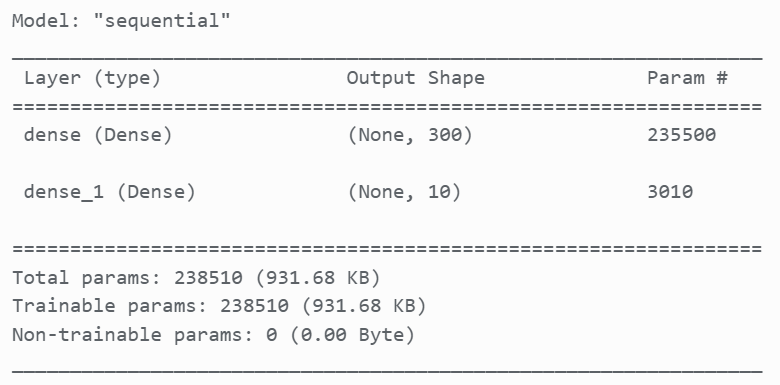
- Number of weights of layer 1 : 784 * 300 + 300 = 235500
- Number of weights of layer 2 : 300 * 10 + 10 = 3010

Total number of weights : 238510

from features :
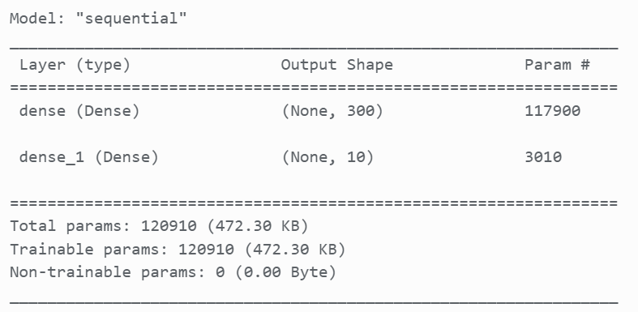
- Number of weights of layer 1 : 392 * 300 + 300 = 117900
- Number of weights of layer 2 : 300 * 10 + 10 = 3010

Total number of weights : 120910

CNN :

For a CNN, the number of weight for a convolutional layer is the number of filters * (filter_height * filter_width * input_channels + 1). The number of weight for a max pooling layer is 0. 


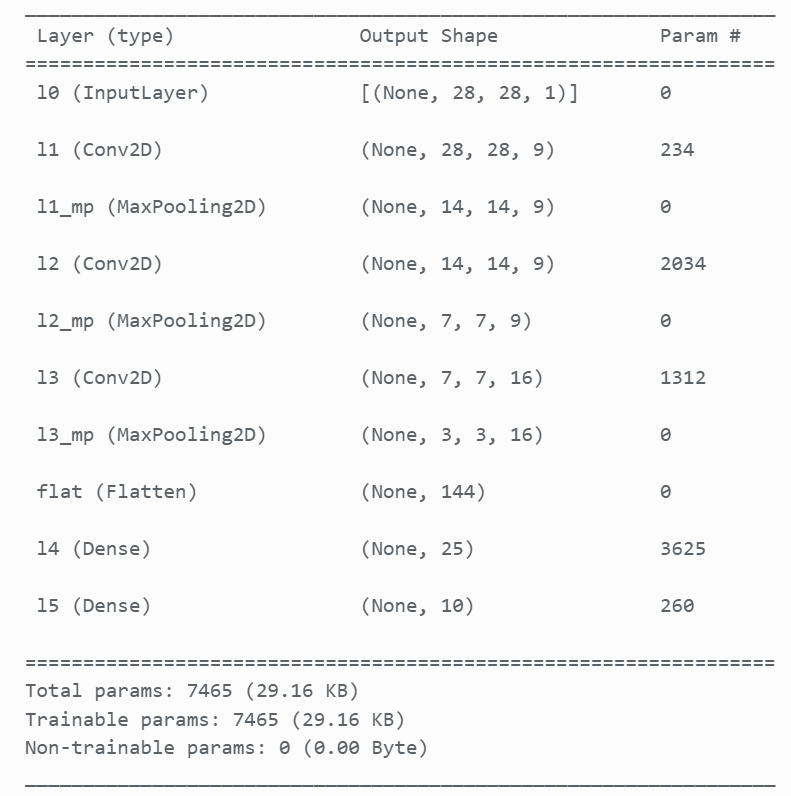
- Number of weights of layer 1 : 9 * (5 * 5 * 1 + 1) = 234
- Number of weights of layer 2 : 0
- Number of weights of layer 3 : 9 * (5 * 5 * 9 + 1) = 2034
- Number of weights of layer 4 : 0
- Number of weights of layer 5 : 16 * (3 * 3 * 9 + 16) = 1312
- Number of weights of layer 6 : 0
- Number of weights of layer 7 : 0
- Number of weights of layer 8 : 144 * 25 + 25 = 3625
- Number of weights of layer 9 : 25 * 10 + 10 = 260

Total number of weights : 7465

## Part 3
### Do the deep neural networks have much more “capacity” (i.e., do they have more weights?) than the shallow ones? explain with one example
Deep neural networks have more layers than shallow neural networks. Each of those layers has a certain number of weights. Therefore, deep neural networks can have more weights than shallow neural networks. But that is not always the case. For example, the shallow neural network with raw data has more weights (238510) than the CNN (7465). This is explained by the fact that CNN has more layers but the number of weights of each layer is smaller than the number of weights of the layers of the shallow neural network. The capacity to learn and exploit complex relation inside the data is linked to the number of layers. As the number of weights is linked to the number of layers, we can say that deep neural networks tend to have more capacity than shallow neural networks.

## Part 4
### Test  every  notebook  for  at  least  three  different  meaningful  cases  (e.g.,  for  the MLP  exploiting  raw  data,  test  different  models  varying  the  number  of  hidden neurons,  for  the  feature-based  model,  test  pix_p_cell  4  and  7,  and  number  of orientations  or  number  of  hidden  neurons,  for  the  CNN,  try  different  number  of neurons in the feed-forward part) describe the model and present the performance of the system (e.g., plot of the evolution of the error, final evaluation scores  and  confusion  matrices).  Comment  the  differences  in  results.  Are  there particular digits that are frequently confused?

#### Experiments on MLP from raw data
Our first experiment is to add an extra layer of 300 neurons. That is, we have 300x300 neurons in the hidden layer.

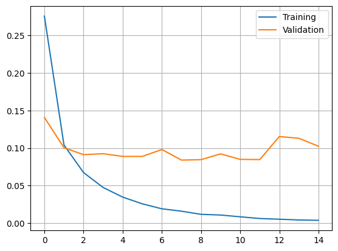

```
FINAL RESULTS:
Test score: 0.09962771087884903
Test accuracy: 0.9804999828338623
```

This slightly improves the performance of the model, but negligeably so. Also, we see that the performance on the validation set jumps back up in later epochs, indicating that overfitting is taking place.

Our next experiment as a follow up to this one is to reduce the number of neurons in the hidden layer to 100x50. The goal of it is to see if we can get similar performance to the initial experiment but reducing the number of total neurons used. We get the following results.

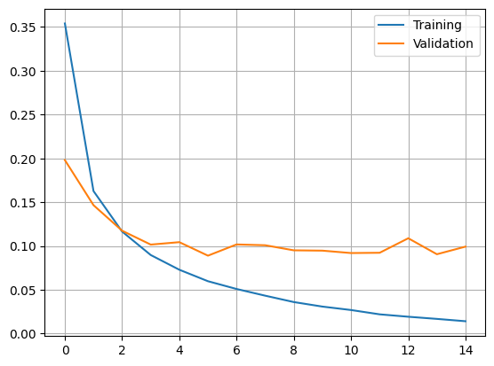

```
FINAL RESULTS:
Test score: 0.08882319182157516
Test accuracy: 0.977400004863739
```

Overall, this slightly worsened the results we got compared to the previous experiment. We can attribute that to the fact that the network seems to still be able to learn, indicated by the fact that the training accuracy hasn't yet flatlined.

This leads us to our final experiment: adding more epochs to hopefully obtain a better trained network.

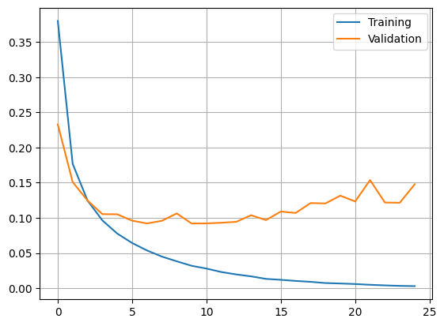

```
FINAL RESULTS:
Test score: 0.1358925849199295
Test accuracy: 0.9757000207901001
```

We clearly see that the validation sets starts gaining loss again, meaning overfitting is taking place. We conclude that our experiment is a failure and does not bring any improvements to the table.

#### Experiments on MLP from HOG

We begin by running the notebook as-is. The result we get is worthy of attention.

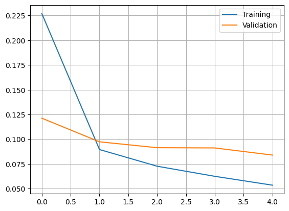

```
FINAL RESULTS:
Test score: 0.07069864869117737
Test accuracy: 0.9772999882698059
```

We notice that the learning process does look like it is not quite finished yet. We will try throughout the next two experiments to increase the performance of the model.

We then go into the next experiment with the idea of increasing the number of epochs slightly. We set it to 10 and get the following results.

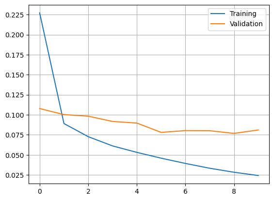

```
FINAL RESULTS:
Test score: 0.06509965658187866
Test accuracy: 0.9793999791145325
```

We see that the results improved marginally. Calling this significant would be an overstatement, but numbers do show some improvement.

As a last experiment, we will attempt to keep the number of epochs to 5, but double the number of orientations to 8. We then got the following results.

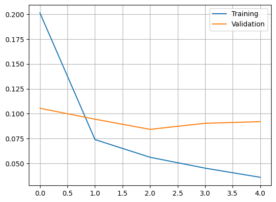

```
FINAL RESULTS:
Test score: 0.0739438384771347
Test accuracy: 0.9768000245094299
```

We see a very small improvement compared to the base model, but not as much as the second experiment. Using a higher number of orientations seems to help with numbers often written using dashes slanted at 22.5 degree angles.

#### Experiments on CNN

We begin by trying the default values present in the notebook. This gives us a basis to start experimenting with.

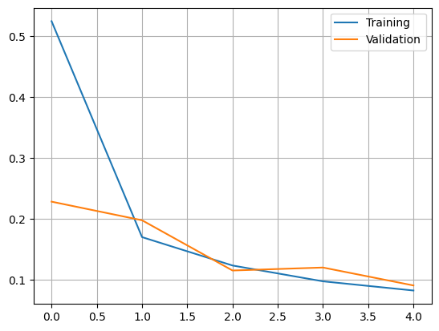

```
FINAL RESULTS:
Test score: 0.08287268877029419
Test accuracy: 0.973800003528595
```

We get the following results, which surprisingly contains the worst test accuracy so far. We will attempt to bring it up to par with other methods in the following two experiments, starting with removing the last convulation and max-pooling layers. We also increase the number of neurons to 50 to see how the model reacts, and get the following results.

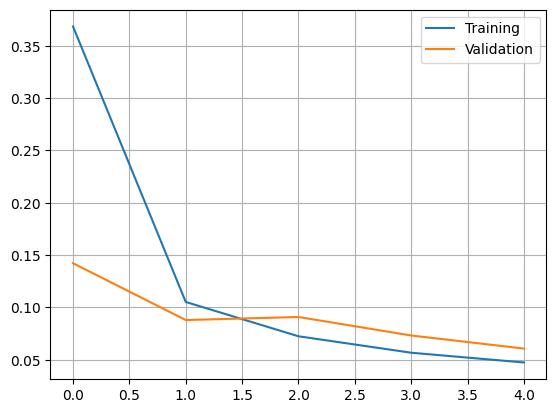

```
FINAL RESULTS:
Test score: 0.04561679810285568
Test accuracy: 0.9843000173568726
```

The results are much better, now on par with the previously evaluated models. 

For the last experiment, we change the structure of the model once again to further increase the number of neuron to 100.

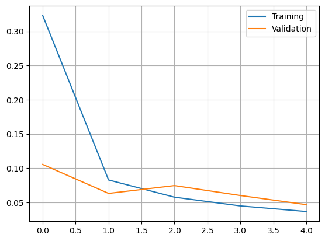

```
FINAL RESULTS:
Test score: 0.03727954253554344
Test accuracy: 0.9869999885559082
```

We observe some marginal improvements compared to the last experiment. We conclude that the original 25 neurons where too little. We could add more epochs, as the model seems to not be done learning just yet.