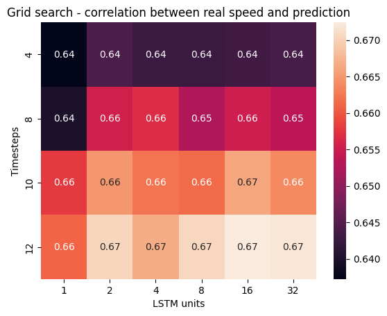
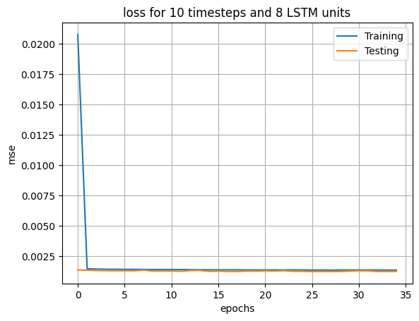
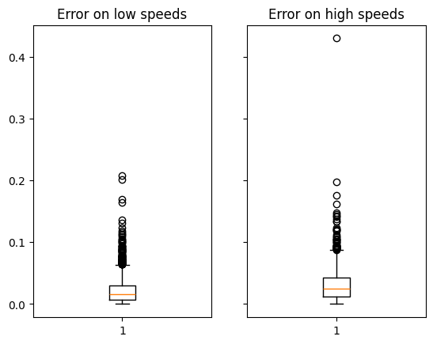
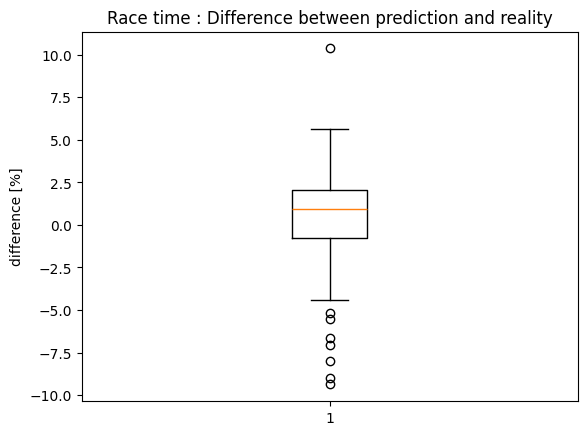

# PW12 - LSTM
Team : Magali Egger, Maxim Golay, Pascal Perrenoud

## LSTM hyperparameters and model
With a batch size of 32 and 35 epochs, here is a heatmap of the correlation between the speed predictions of a model and the ground truth.


With this loss graph example (for 10 timesteps and 8 LSTM units), we can see that we don't need a lot of epochs to train the model.
The other loss graphs are similar.
We think that the MSE values are really low and the "test" loss being that low and constant aren't good signs for the model.
We thought we had an error somewhere, we tried to find it without success.
We will see later, when predicting race times, that our model is pretty good at predicting.



## Errors
The largset speed difference found is 3.79 m/s.
We can't really define if most errors occurs on low or high speeds.
This graph shows that high speeds predictions have a bit more errors, but it doesn't really look significant.



## Races time : prediction vs ground truth
The following code computes the expected race time based on the average of the predicted speeds and the distance of a race.

```python
preds = []
truths = []

for idx in np.unique(dataset["race"]):
  race = original_dataset[original_dataset["race"] == idx]
  distance = race["distance"].max()
  time = race["time"].max()
  X, _ = create_x_y(dataset, [idx], TIMESTEPS[-1])
  avg_speed_pred = np.average(model.predict(X)) * (max_speed - min_speed) + min_speed
  preds.append(distance / avg_speed_pred)
  truths.append(time)

print(np.corrcoef(preds, truths)[0,1])
pl.boxplot(np.subtract(preds, truths))
```

The correlation between the predicted race times and the reality is surprisingly high, with a correlation of 99%.
This graph shows the difference between the predicted times and the reality, expressed as % of the real race time.
We can see that the error is in the range +-10% but centered on 0.


